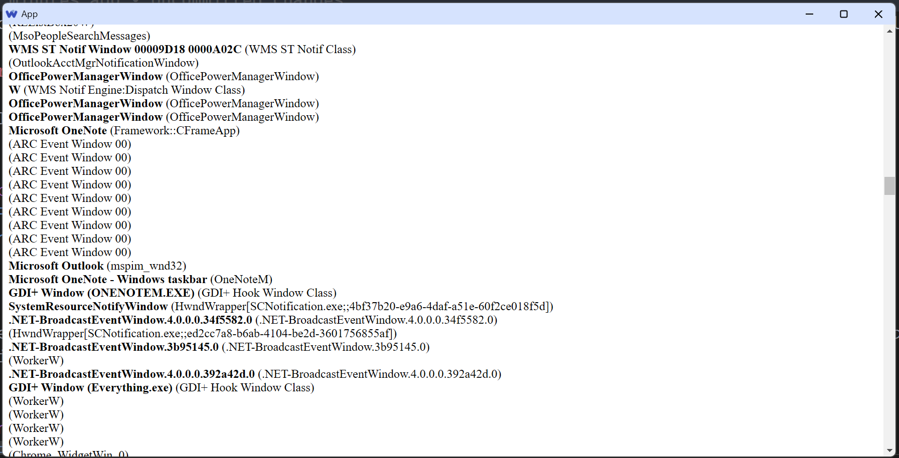

# Deno Web app

This is a template for a web app that uses Deno as backend and TypeScript as frontend.

This template also implement a feature that enumerates all windows on Windows OS and shows them in the UI to demonstrate typed-communications between frontend and backend.

To run it, clone the repo and run: `run.bat` on Windows, or invoking tsc and deno manually on other platforms.

(pre-requisite: deno, tsc)

## Usage

You define API interfaces between the web client and the backend script in `api.ts`:

```typescript
    export type API = {
        checkResult: (a:number, b:number, res:number) => string,
        getWindows: () => {title:string, className:string}[]
    }
    export const api: Promisify<API> = {
        checkResult: (a, b, res) => fetchAPI('checkResult', [a, b, res]),
        getWindows: () => fetchAPI('getWindows', []),
    }
```

Then you implement the API in `api_impl.ts`.

Now you can use the API as normal function in the web client, e.g.:

```typescript
    import {api} from '../api.js'
    ...
    const windows = await api.getWindows()
    for (const w of windows) {
        const div = document.createElement('div');
        div.innerHTML = `<b>${w.title}</b> (${w.className})`;
        app.appendChild(div);
    }
    document.body.appendChild(app);
```
