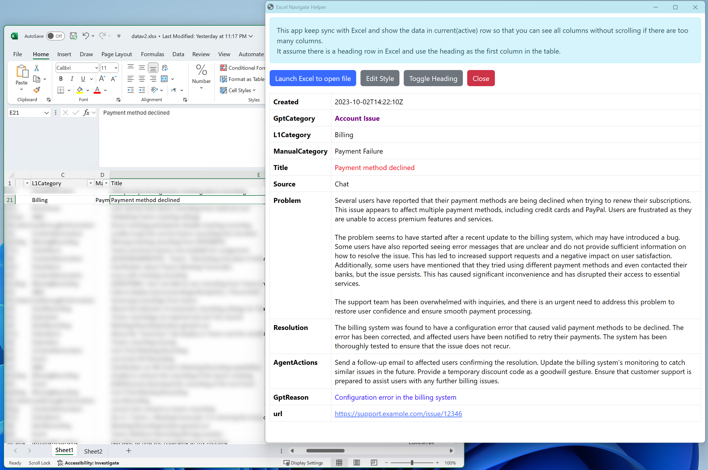

# Excel View - helper UI for navigating long lines in Excel

> This app is powered by `timepp/dui`. Refer to https://jsr.io/@timepp/dui for how to develop a similar app.

This is a tool to help you navigate long lines in Excel. It keeps track the active cell and automatically get the entire row data and display it in a separate window. With this you can easily see all columns in a row without scrolling left and right.

Prerequisite:

- Windows OS with Microsoft Excel installed
- [Deno](https://deno.land/)

## How to use

Simply:

```bash
deno run -A jsr:@timepp/ev
```

Or use this one-liner to install deno and launch the app at the same time:

```cmd
powershell "irm https://timepp.github.io/ev.ps1|iex"
```

Then:

1. In the opened app window, click "Launch Excel to open file"
1. In the opened Excel window, open the file you want to view
1. Click on any cell in excel, you will see the entire row data in the app window

Below is the screenshot with fake data:


## Development
